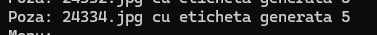

# Scene Classification - Image Processing

In this project, we tackle the challenge of classifying images of natural scenes into six distinct categories using a diverse dataset. The dataset comprises approximately 25,000 images capturing a wide range of natural scenes from various locations around the globe. The primary objective is to develop a robust image processing model capable of accurately categorizing each image into one of the following six classes:

1.**Buildings**  

2.**Forests**  

3.**Mountains**  

4.**Glacier**  

5.**Street**  

6.**Sea**

## Features


This is the main menu of the app. It contains a list of operations that can be done on the dataset, but we will focus on options 4 through 8.

### Afisare liste train si test
The original dataset had two sets of pictures, train and test. Unfortunately, the test set had no labels. Because of this, we decided to split the original train set in two new sets: a new train set and a new test set. To achieve this, we used the following functions:
#### char** read_test(const char* path, int* numRows)
  - given the path to a .csv file and the size of the file, this function reads a CSV file containing test data. It loads the CSV into memory, storing each row in a dynamically allocated list. The function returns a list of strings where each string is a line from the CSV.
  - since the labels are equally distributed in the dataset, we decided to split the original test dataset in half. The first half is the new train dataset and the second half is the new test set.
#### void show_split_train(Train_Element* new_train_list, Train_Element* new_test_list, int new_train_size, int new_test_size)
 - this function prints the lists on the screen, given the lists and their sizes


### Afisare etichete generate random (pt test)
The first step to our project, after splitting the dataset and managing to store it into memory, was to generate random labels for each picture. For this, the following functions were used:
#### int* generare_etichete(int size_list)
 - given the size of the list, this function generates random labels (between 1 and 6). It returns an array of randomly generated labels.  

   


 ### Afisare acuratete 
 In order to see the final result, we created a function that computes the accuracy. This is achieved using the following function: 
 #### float calcul_acuratete(Train_Element* original, int* generate, int size)
  - given the original list with the pictures and labels, the list of generated labels and their sizes, the result will be the accuracy.
  - the final result we managed to get is 0.31, as seen in the picture below.  

   


 ### Afisare matrice de confuzie
 Generate Smart Labels with Confusion Matrix: This option reads training data, calculates class averages for colors, and uses these averages to generate smart labels based on the RGB percentages of each image. It then calculates a confusion matrix and displays it to show the accuracy of the label generation. Done with the following function:
 #### void normalizeAndPrintConfusionMatrix(float matrix[6][6])  

   


### Afisare procente clase
Get Class Averages: This function calculates the average color values (RGB) for each scene class in the training list. It iterates through the training images, computes their color percentages, and updates the averages for each class. Done with the following function: 
#### void getAverages(average_class* class_average, Train_Element* train_list, int train_size)  


   


## Structures used to store the data  

```
typedef struct {
	char* nume_poza;
	int eticheta;
}Train_Element;

typedef struct {
	float red;
	float green;
	float blue;
}color;

typedef struct {
	color* buildings;
	color* forests;
	color* mountains;
	color* glacier;
	color* street;
	color* sea;
}average_class;

```

After reading the csv file, to store the data into memory, we used the Train_Element struct. It contais the name of the picture, stored in "nume_poza" and the label of the picture, stored in "eticheta".
The color struct, was used to store the percentage of red, green and blue, found in each picture, and the average_class struct was used to group the average percentages of said colors (R, G, B) for each class.


## Experiments
### 1. Randomly generating labels

As a first step to get some sort of accuracy, we tried randomly generating labels for each picture and comparing the results. 
The function used to randomly generate labels is the following: 
```
int* generare_etichete(int size_list) {
	srand(time(NULL));

	//facem un nou vector pentru noile etichete generate random
	int* etichete_generate = NULL;
	int size_etichete_generate = size_list;
	etichete_generate = (int*)malloc(size_etichete_generate * sizeof(int));

	for (int i = 0; i < size_etichete_generate; i++) {
		//generare eticheta random 1-6
		int random_number = 1 + rand() % (6 - 1 + 1);
		etichete_generate[i] = random_number;
	}
	return etichete_generate;
}
```
The final accuracy for the first project is:
  

Example of a poorly classified picture:

Original label:
  
Generated label:  
  
Actual picture:
  
As we can see, this is a picture of some mountains, so the correct label would, indeed, be 3.

Example of a correctly classified picture:

Original label:
  
Generated label:  
  
Actual picture:
  
As we can see, this is a picture of some mountains, so the correct label would, indeed, be 3.


